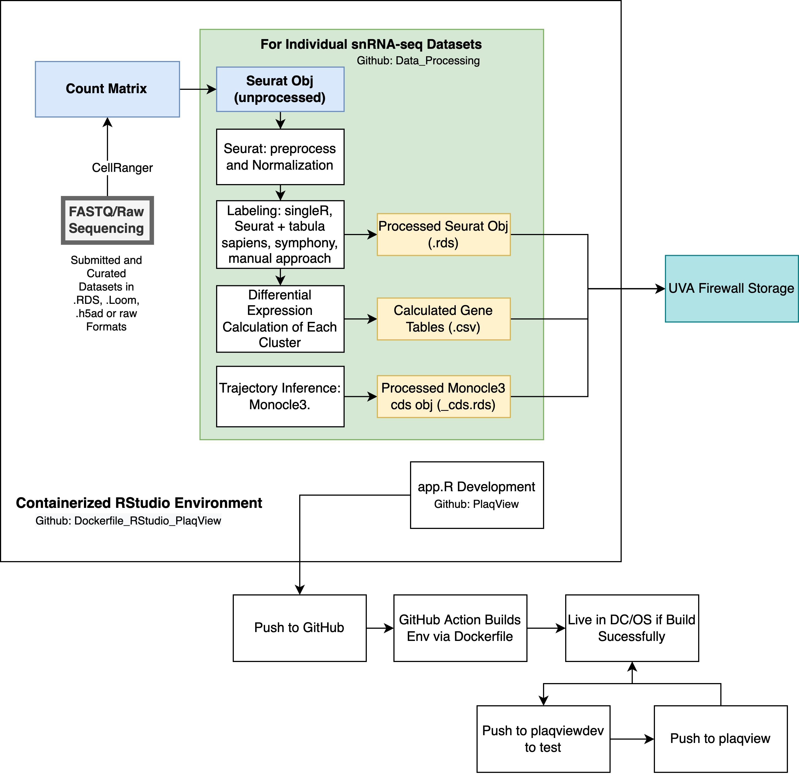

# PlaqView Dockerfiles

 Wei Feng Ma, MSTP UVA. Miller Lab.

## This repo contains the Dockerfile to reproduce rstudio sessions to process scRNA-seq data and develop PlaqView

**OPTION #1**

1) install Docker desktop. See: https://www.docker.com/
2) start Docker desktop
3) from Terminal run the following command: docker pull wfma888/plaqviewmaster:12082021 (or whatever tag you want)
4) start the container (see below for example snippet codes)

**OPTION #2**
1) install Docker desktop. See: https://www.docker.com/
2) start Docker desktop
3) from Terminal, build the Docker image 
4) start the customized Docker image
5) view the RStudio session in your browser.

[**EXAMPLE CODE SNIPPETS TO INITIATE DOCKER**](https://debonair-emperor-653.notion.site/Docker-Commands-0d554663828c4f46b8c40a093dd9e2a5)

Note: directories in the snippets are specific for my computer, you need to adjust the working directory (via cd) first!

